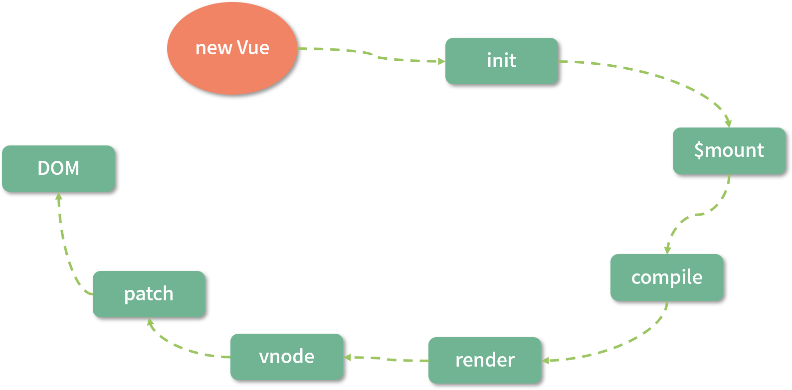
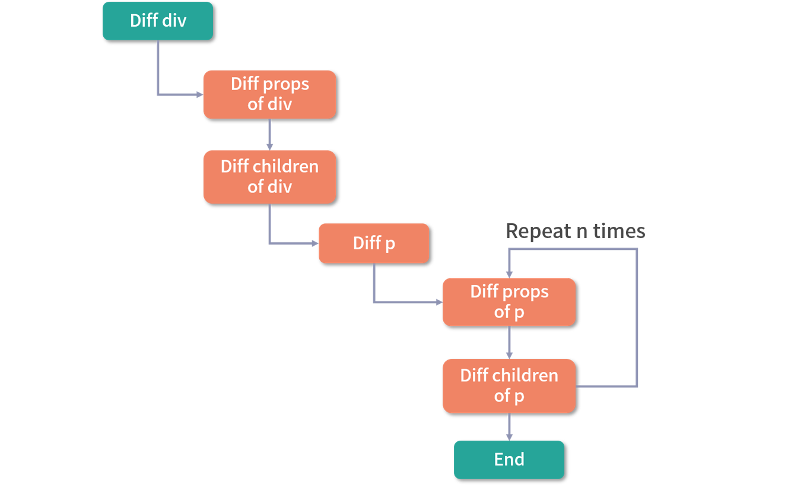
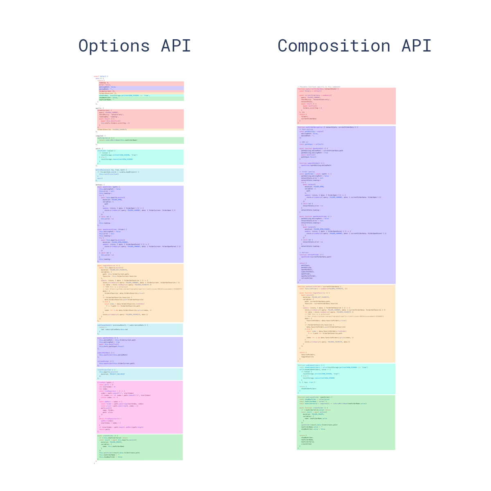

# Vue 3.0 的优化

## 源码优化

源码的优化主要体现在使用 `monorepo` 和 `TypeScript` 管理和开发源码，这样做的目标是提升自身代码可维护性。

### 更好的代码管理方式：monorepo

`Vue.js 3.0` 中整个源码是通过 `monorepo` 的方式维护的，根据功能将不同的模块拆分到 `packages` 目录下面不同的子目录中：


可以看出相对于 `Vue.js 2.x` 的源码组织方式，`monorepo` 把这些模块拆分到不同的 `package` 中，每个 `package` 有各自的 API、类型定义和测试。这样使得模块拆分更细化，职责划分更明确，模块之间的依赖关系也更加明确，开发人员也更容易阅读、理解和更改所有模块源码，提高代码的可维护性。

另外一些 `package`（比如 `reactivity` 响应式库）是可以独立于 `Vue.js` 使用的，这样用户如果只想使用 `Vue.js 3.0` 的响应式能力，可以单独依赖这个响应式库而不用去依赖整个 Vue.js，减小了引用包的体积大小，而 `Vue.js 2 .x` 是做不到这一点的。

### 有类型的 JavaScript：TypeScript

`TypeScript` 提供了更好的类型检查，能支持复杂的类型推导；由于源码就使用 `TypeScript` 编写，也省去了单独维护 `d.ts` 文件的麻烦；就整个 `TypeScript` 的生态来看，`TypeScript` 团队也是越做越好，`TypeScript` 本身保持着一定频率的迭代和更新，支持的 `feature` 也越来越多。

## 性能优化

### 源码体积优化

首先是源码体积优化，我们在平时工作中也经常会尝试优化静态资源的体积，因为 `JavaScript` 包体积越小，意味着网络传输时间越短，`JavaScript` 引擎解析包的速度也越快。 

Vue3.0 源码体积到底优化了哪些方面呢？

* 首先，移除一些冷门的 feature（比如 filter、inline-template 等）；
* 其次，引入 tree-shaking 的技术，减少打包体积。

`tree-shaking` 它的原理很简单，`tree-shaking` 依赖 `ES2015` 模块语法的静态结构（即 `import` 和 `export`），通过编译阶段的静态分析，找到没有引入的模块并打上标记。

也就是说，利用 `tree-shaking` 技术，如果你在项目中没有引入 `Transition`、`KeepAlive` 等组件，那么它们对应的代码就不会打包，这样也就间接达到了减少项目引入的 `Vue.js` 包体积的目的。

### 数据劫持优化

在 `Vue.js` 内部，想实现这个功能是要付出一定代价的，那就是必须劫持数据的访问和更新。其实这点很好理解，当数据改变后，为了自动更新 `DOM`，那么就必须劫持数据的更新，也就是说当数据发生改变后能自动执行一些代码去更新 `DOM`，那么问题来了，`Vue.js` 怎么知道更新哪一片 `DOM` 呢？因为在渲染 `DOM` 的时候访问了数据，我们可以对它进行访问劫持，这样就在内部建立了依赖关系，也就知道数据对应的 `DOM` 是什么了。以上只是大体的思路，具体实现要比这更复杂，内部还依赖了一个 `watcher` 的数据结构做依赖管理，参考下图：


在 `Vue.js 1.x` 和 `Vue.js 2.x` 内部都是通过 `Object.defineProperty` 这个 API 去劫持数据的 `getter` 和 `setter`，具体是这样的：

```javascript
Object.defineProperty(data, 'a', {
  get(){
    // track
  },
  set(){
    // trigger
  }
})
```

但这个 API 有一些缺陷，它必须预先知道要拦截的 `key` 是什么，所以它并**不能检测对象属性的添加和删除**。尽管 `Vue.js` 为了解决这个问题提供了 `$set` 和 `$delete` 实例方法，但是对于用户来说，还是增加了一定的心智负担。

另外 `Object.defineProperty` 的方式还有一个问题。由于 `Vue.js` 无法判断你在运行时到底会访问到哪个属性，所以对于这样一个嵌套层级较深的对象，如果要劫持它内部深层次的对象变化，就需要递归遍历这个对象，执行 `Object.defineProperty` 把每一层对象数据都变成响应式的。毫无疑问，如果我们定义的响应式数据过于复杂，这就会有相当大的性能负担。

为了解决上述 2 个问题，`Vue.js 3.0` 使用了 `Proxy` API 做数据劫持，它的内部是这样的：

```javascript
const observed = new Proxy(data, {
  get() {
    // track
  },
  set() {
    // trigger
  }
})
```

由于它劫持的是整个对象，那么自然对于对象的属性的增加和删除都能检测到。

但要注意的是，`Proxy` API 并不能监听到内部深层次的对象变化，因此 `Vue.js 3.0` 的处理方式是在 `getter` 中去递归响应式，这样的好处是**真正访问到的内部对象才会变成响应式，而不是无脑递归**，这样无疑也在很大程度上提升了性能。

### 编译优化

这是 `Vue.js 2.x` 从 `new Vue` 开始渲染成 `DOM` 的流程，上面说过的响应式过程就发生在图中的 `init` 阶段，另外 template compile to render function 的流程是可以借助 `vue-loader` 在 `webpack` 编译阶段离线完成，并非一定要在运行时完成。



所以想优化整个 `Vue.js` 的运行时，除了数据劫持部分的优化，我们可以在耗时相对较多的 `patch` 阶段想办法，`Vue.js 3.0` 也是这么做的，并且它**通过在编译阶段优化编译的结果，来实现运行时 `patch` 过程的优化。**

我们知道，通过数据劫持和依赖收集，Vue.js 2.x 的数据更新并触发重新渲染的粒度是组件级的：

虽然 Vue 能保证触发更新的组件最小化，但在单个组件内部依然需要遍历该组件的整个 vnode 树，举个例子，比如我们要更新这个组件：

```markup
<template>
  <div id="content">
    <p class="text">static text</p>
    <p class="text">static text</p>
    <p class="text">{{message}}</p>
    <p class="text">static text</p>
    <p class="text">static text</p>
  </div>
</template>
```

整个 diff 过程如图所示：



可以看到，因为这段代码中只有一个动态节点，所以这里有很多 `diff` 和遍历其实都是不需要的，这就会导致 `vnode` 的性能跟模版大小正相关，跟动态节点的数量无关，当一些组件的整个模版内只有少量动态节点时，这些遍历都是性能的浪费。

而对于上述例子，理想状态只需要 `diff` 这个绑定 `message` 动态节点的 `p` 标签即可。

`Vue.js 3.0` 做到了，它通过编译阶段对静态模板的分析，编译生成了 `Block tree`。`Block tree` 是一个将模版基于动态节点指令切割的嵌套区块，每个区块内部的节点结构是固定的，而且每个区块只需要以一个 `Array` 来追踪自身包含的动态节点。借助 `Block tree`，`Vue.js` 将 `vnode` 更新性能由与模版整体大小相关提升为与动态内容的数量相关，这是一个非常大的性能突破。

除此之外，`Vue.js 3.0` 在编译阶段还包含了对 `Slot` 的编译优化、事件侦听函数的缓存优化，并且在运行时重写了 `diff` 算法。

## 语法 API 优化：Composition API

除了源码和性能方面，`Vue.js 3.0` 还在语法方面进行了优化，主要是提供了 `Composition API`。

### 优化逻辑组织

`Vue.js 3.0` 提供了一种新的 `API：Composition API`，它可以将某个逻辑关注点相关的代码全都放在一个函数里，这样当需要修改一个功能时，就不再需要在文件中跳来跳去。

通过下图，我们可以很直观地感受到 `Composition API` 在逻辑组织方面的优势：



### 优化逻辑复用

当我们开发项目变得复杂的时候，免不了需要抽象出一些复用的逻辑。在 `Vue.js 2.x` 中，我们通常会用 `mixins` 去复用逻辑。

使用单个 `mixin` 似乎问题不大，但是当我们一个组件混入大量不同的 `mixins` 的时候，会存在两个非常明显的问题：**命名冲突和数据来源不清晰**。

首先每个 `mixin` 都可以定义自己的 `props`、`data`，它们之间是无感的，所以很容易定义相同的变量，导致命名冲突。另外对组件而言，如果模板中使用不在当前组件中定义的变量，那么就会不太容易知道这些变量在哪里定义的，这就是数据来源不清晰。但是`Vue.js 3.0` 设计的 `Composition API`，就很好地帮助我们解决了 `mixins` 的这两个问题。

