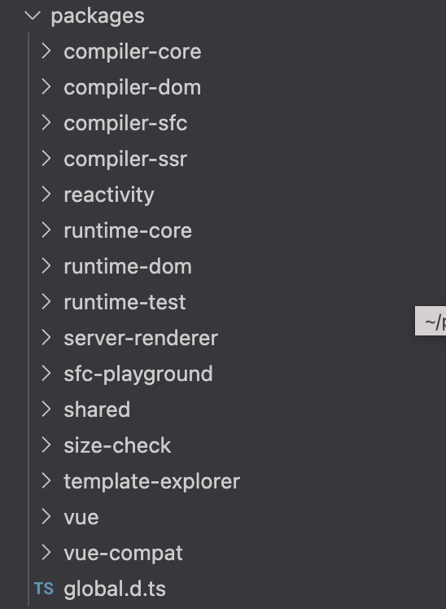

# Vue 3.0 的优化

## 源码的优化

源码的优化主要体现在使用 `monorepo` 和 `TypeScript` 管理和开发源码，这样做的目标是提升自身代码可维护性。

#### 更好的代码管理方式：monorepo

`Vue.js 3.0` 中整个源码是通过 `monorepo` 的方式维护的，根据功能将不同的模块拆分到 `packages` 目录下面不同的子目录中：

可以看出相对于 `Vue.js 2.x` 的源码组织方式，`monorepo` 把这些模块拆分到不同的 `package` 中，每个 `package` 有各自的 API、类型定义和测试。这样使得模块拆分更细化，职责划分更明确，模块之间的依赖关系也更加明确，开发人员也更容易阅读、理解和更改所有模块源码，提高代码的可维护性。

另外一些 `package`（比如 `reactivity` 响应式库）是可以独立于 `Vue.js` 使用的，这样用户如果只想使用 `Vue.js 3.0` 的响应式能力，可以单独依赖这个响应式库而不用去依赖整个 Vue.js，减小了引用包的体积大小，而 `Vue.js 2 .x` 是做不到这一点的。

#### 有类型的 JavaScript：TypeScript

`TypeScript` 提供了更好的类型检查，能支持复杂的类型推导；由于源码就使用 `TypeScript` 编写，也省去了单独维护 `d.ts` 文件的麻烦；就整个 `TypeScript` 的生态来看，`TypeScript` 团队也是越做越好，`TypeScript` 本身保持着一定频率的迭代和更新，支持的 `feature` 也越来越多。

